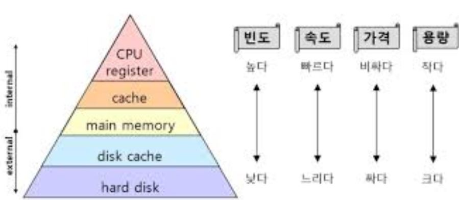
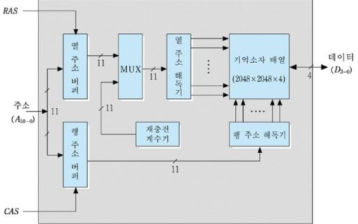
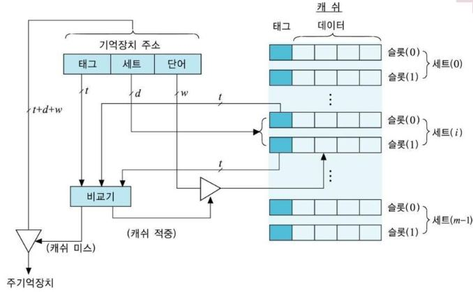

### chap5. 기억장치

------

- 데이터를 저장하는 장치: 주기억장치, 보조기억장치
- 그러나 성능 및 가성비를 개선하기 위해 다양한 기억장치를 시스템에 포함하는 추세
- 내부 기억장치: CPU가 직접 액세스
- 외부 기억장치: 장치 제어기를 통해 접근

 chap5 에서는 내부 기억장치에 대해 알아본다.

#### 5.1 기억장치의 분류와 특성

- 액세스: cpu가 어떤 정보를 기억장치에 쓰거나 기억장치로부터 읽는 동작
- 액세스는 다음과 같이 분류된다.
  - 순차적 액세스: 처음부터 순서대로 액세스하는 방식
  - 직접 액세스: 정보가 위치한 근처로 직접 이동시킨후, 순차적 검색으로 최종 위치에 도달하는 액세스 방식
  - 임의 액세스: 기억 장소들이 임의로 선택될 수 있으며, 기억장치 내의 어떤 위치든 액세스에 걸리는 시간이 동일
  - 연관 액세스: 각 기억 장소에 KEY값의 검색을 통하여 액세스할 위치를 찾아내는 방식

기억장치 시스템 설계에 있어 주요한 특성은 **용량**과 **액세스 속도**이다. 

용량:

- 기억 장치의 용량을 나타내는 단위: byte(혹은 word)

- CPU가 한 번의 액세스로 접근 가능한 비트 수: 전송 단위, block

- 하나의 주소에 의해 액세스되는 비트들의 그룹: 주소지정 단위

액세스 속도:

- 액세스 시간: 주소와 읽기/쓰기 신호가 기억장치에 도착한 순간부터 데이터가 저장되거나 읽혀지는 동작이 완료될 때까지의 시간
- 기억장치 사이클 시간: 액세스 시간과 데이터 복원 시간을 합한 시간
- 데이터 전송률: 기억장치로부터 초당 읽혀지거나 쓰여질 수 있는 비트수

기억장치의 재료에 따른 분류:

- 반도체 기억장치
- 자기-표면 기억장치
- 광 저장장치

기억장치의 성질에 따른 분류:

- 휘발성 기억장치
- 비휘발성 기억장치

#### 5.2 계층적 기억장치시스템

CPU와 기억장치간의 속도 차이에 의해 성능이 떨어질 수 있다. 이를 해결하기 위하여 여러 유형의 기억장치들을 계층적으로 구성하여 설치한다. 이를 계층적 기억장치 시스템이라 한다.

**5.2.1 필요성 및 효과**

가격, 용량, 속도간에 적절한 tradeoff가 필요하다.

가격, 용량, 속도간의 관계: 속도 ∝ 가격, 용량 ∝ 1/가격, 용량 ∝ 1/속도

 CPU가 기억장치의 한정된 몇몇 영역들을 주로 액세스하며 작업을 수행한다(예를 들면 반복 루프). 이런 현상을 지역성의 원리라 하는데 이 원리로 인해 첫 번째 계층의 기억장치에 액세스 하는 횟수가 두 번째 계층의 기억장치에 액세스 하는 횟수보다 훨씬 더 많아진다. 첫 번째 계층에 액세스를 자주 할 수록 평균 액세스 시간은 비약적으로 짧아지기 때문에 기억장치를 계층적으로 구성하면 평균 액세스 시간을 크게 단축시킬 수 있다.

**5.2.2 기억장치 계층**

- cache: CPU와 주기억장치 사이에 속도가 빠르지만 용량은 작은 메모리를 이용해 속도 차이를 보완해준다. 이 메모리는 프로그래머에게는 보이지 않으며(프로그램을 통해 접근 불가) 버퍼역할을 한다.
- disk cache: 주기억장치와 디스크의 속도 차이를 줄이기 위하여 그 사이에 설치하는 기억장치. 버퍼역할을 한다.
- 하위 계층으로 갈수록 용량이 더 커지고 비트당 가격을 떨어지는 반면에, 지역성의 원리로 인해 액세스 빈도는 더 낮아진다.
- 결과적으로 계층적 방식을 이용하여 더 적은 비용으로 더 빠르고 더 용량이 큰 기억장치시스템을 구성할 수 있게 된다.

#### 5.3 반도체 기억장치

**5.3.1 RAM**

임의 액세스 방식을 사용하며 읽기와 쓰기가 가능한 기억장치이다. 휘발성이 있기 때문에 전원이 차단되면 데이터를 잃어버린다.

- DRAM: 캐패시터에 전하를 충전하는 방식으로 데이터를 저장하는 RAM이다. refresh 가 필요하다.
- SRAM: 플립-플롭형 기억 셀을 이용하며 전력이 공급되는 동안 데이터가 유지되는 RAM이다.
- DRAM은 간단하며 작다. 따라서 가격이 싸다. -> 주기억장치
- SRAM은 DRAM보다 속도가 빠르다. -> 캐시 메모리

- 기억소자 배열의 공간이 16M개 이므로 총 24개의 선이 필요하다. 그러나 타이밍을 이용해 시간차를 두고 데이터를 읽는 방식으로 12개의 선으로도 주소지정이 가능해진다. 이는 패키지의 크기를 줄이는데 많은 도움이 된다.
- 기억장치 액세스가 일어나지 않는 사이클 동안에는 재충전 계수기가 0~4095까지의 주소를 순서대로 발생하며, 내부 MUX에 의해 각 행씩 전기를 인가하여 refresh를 한다.

**5.3.2 ROM**

Read Only Memory 즉, 읽기만 가능하다. 주로 변경될 수 없는 데이터를 저장하는 데 사용된다. 다음과 같은 내용이 저장된다.

- 시스템 초기화 및 진단 프로그램
- 빈번히 사용되는 함수 및 서브루틴
- 제어 유니트의 마이크로프로그램

ROM은 영구 저장이 가능한 저장장치이며 액세스 시간이 짧다. ROM의 종류로는 다음과 같다.

- PROM: 단 한번만 쓰기가 가능한 ROM. 수정은 불가능하다.
- EPROM: 자외선을 이용하여 내용 삭제가 가능하다. 내용을 삭제한 후에는 쓰기가 가능해진다. 삭제하는데에 시간이 오래 걸림.
- EEPROM: 전기적으로 삭제할 수 있다. 읽기와 쓰기 동작에 걸리는 시간 차이가 크다.
- 플래시 메모리: 속도가 매우 빠르며 전기적으로 삭제 또한 가능한 메모리. 단, 쓰기 동작에서 페이지 단위로만 동작한다.

#### 5.4 기억장치 모듈의 설계

 여러 개의 RAM(혹은 ROM)을 접속하여 원하는 용량 또는 원하는 처리 능력을 얻을 수 있다. 접속 방법은 두 가지가 있다.

- 병렬 접속: 한번에 액세스하는 단어 길이를 키우기 위해서는 RAM을 병렬로 접속하면 된다. 
- 직렬 접속: 용량을 키우기 위해서는 RAM을 직렬로 접속하면 된다.
- 병렬과 직렬을 조합하여 원하는 용량의 기억장치 모듈을 설계가능하다.

#### 5.5 캐시 메모리

CPU와 주기억장치의 속도차이를 보완하기 위해 그 사이에 설치하는 반도체 기억장치이다. 

 CPU가 기억장치로부터 어떤 데이터를 읽으려고 할 때에는 먼저 그 데이터가 캐시에 있는지를 검사한다. 액세스 시간이 단축되기 때문.

 CPU가 원하는 데이터가 이미 캐시에 적재되어 있는 상태를 캐시 적중이라고 한다. 그 반대의 경우 캐시 미스.

 캐시 적중률(H) = 캐시 적중 횟수/전체 액세스 횟수

 캐시 미스율 = 1 - 캐시 적중률 = 1 - H

 평균 기억장치 액세스 시간(Ta) = H * Tc(캐시 액세스 시간) + (1 - H) * Tm(주기억장치 액세스 시간)

 캐시 적중률이 높아질 수록 캐시의 사용 효과가 더 커진다. 캐시 적중률은 지역성에 크게 의존하는데 여기서의 지역성이란 주기억장치의 특정 부분에 위치한 데이터를 빈번히 혹은 집중적으로 액세스하는 현상을 의미한다. 지역성은 특징에 따라 다음과 같이 분류가 가능하다.

- 시간적 지역성: 최근에 액세스된 데이터가 가까운 미래에 다시 액세스될 가능성이 높아지는 특성. 반복 루프 프로그램, 서브루틴, 공통 변수 등.
- 공간적 지역성: 기억장치 내에 서로 인접하여 저장되어 있는 데이터들이 연속적으로 액세스될 가능성이 높아지는 특성. 배열 데이터 등.
- 순차적 지역성: 분기가 발생하지 않는 한, 명령어들은 기억장치에 저장된 순서대로 인출되어 실행된다. 순서되로 인출되는 특성을 의미.

 캐시 설계 과정에서 공통적인 목표는 다음과 같다.

- 캐시 적중률 극대화
- 캐시 액세스 시간 최소화
- 캐시 실패에 따른 지연시간 최소화
- 주기억장치와 캐시간의 데이터 일관성 유지

  다음과 같은 방법들로 목표를 달성가능하다.

**5.5.1 캐시 용량**

 캐시의 용량이 크면 적중률이 높아진다. 무작정 높이는 것은 가격 증가 및 회로의 복잡성 증가로 인해 불가능하기 때문에 최적의 용량을 찾는 것이 중요.

**5.5.2 인출 방식**

 주기억장치로부터 캐시로 정보를 어떻게 인출하는지에 따라서 캐시 적중률에 많은 영향을 준다.

- 요구 인출: 필요한 정보만 인출
- 선인출: 앞으로 필요할 것으로 예측되는 정보(근접한 데이터들 = 블록)도 같이 인출. 지역성이 높은 경우 효과적이다.

 캐시는 tag로 구분하여 어떤 블록이 담겨있는지 가리킨다.

**5.5.3 사상 방식**

 어떤 주기억장치 블록들이 어느 캐시 라인을 공유할 것인지를 결정해주는 방법: 주기억장치와 캐시간의 사상방식

 사상방식은 캐시 적중률에 많은 영향을 준다. 그 방식들은 다음과 같다.

- 직접 사상: 각 블록은 지정된 특정 라인에만 적재될 수 있는 방식(모듈러 연산으로 특정 라인을 결정)
  - 장점: 간단하여 구현하는 비용이 적게 든다.
  - 단점: 같은 라인에 사상되는 두 개의 블록들로부터 데이터를 번갈아 읽어오는 경우 적중률이 낮아진다.
- 완전-연관 사상: 주기억장치 블록이 캐시의 어느 라인이로든 적재될 수 있는 사상방식. 캐시가 모두 차 있을 경우 적절한 **교체 알고리즘**을 이용해 라인들 중 하나를 선택해 새로운 내용으로 덮어쓴다. 태그 검사가 복잡하여 거의 채택되지 않는 시스템.
- 세트-연관 사상: 직접 사상 + 완전-연관 사상법. tag와 set, word 비트를 사용한다.

 보통 2-way ~ 4-way 세트를 사용한다.

**5.5.4 교체 알고리즘**

 캐시 미스가 발생하여 새로운 블록을 적재할 경우 캐시가 이미 빈 공간이 없으면 기존 블록 위에 덮어 써야 한다. 어떤 블록을 덮을지에 대해 교체 알고리즘을 이용하여 선택해야한다.

- 최소 최근 사용 알고리즘: 사용되지 않은 채로 가장 오래 적재되어있는 블록을 교체
- FIFO 알고리즘: 캐시에 적재된 지 가장 오래된 블록을 교체
- 최소 사용 빈도 알고리즘: 캐시에 적재된 이후 참조되었던 횟수가 가장 적은 블록을 교체
- 임의 선택: 무작위로 블록을 선택하여 교체

**5.5.5 쓰기 정책**

캐시에 적재된 데이터를 새로운 값으로 변경할 때 주기억장치에 갱신하는 시기와 방법을 결정하는 방식

- write-through 방식: 모든 쓰기 동작이 캐시, 주기억장치로 동시에 행해진다.
  - 단점: 쓰기 동작에 걸리는 시간이 길어진다
- write-back 방식: 쓰기 동작이 캐시까지만 이루어지는 방식, M bit를 사용하여 수정 여부를 기록
  - 단점: 특정한 경우 추가시간 발생, 수정된 내용이 갱신될 때 까지 주기억장치의 해당 블록이 무효 상태에 놓임, 캐시 제어회로 복잡, M bit를 갖고있어야 함.
  - 다중프로세서시스템에서 이 방식을 채택할 경우 데이터 불일치 문제가 발생한다.

**5.5.6 다중 캐시**

 계층적 구조로 캐시를 설치 혹은 기능별로 분리된 다수의 캐시를 사용하는것이 보편화되고 있다.

- 슈퍼 세트: 내부 캐시 L1과 외부 캐시 L2가 있을 때 L2가 L1의 슈퍼-세트 라고 한다.

1. 온-칩 캐시와 계층적 캐시
   - CPU 내부에 포함시크는 캐시를 온-칩 캐시라 한다. 액세스 시간이 더욱 빠름.
   - CPU 외부에 캐시를 별도로 더 설치하여 계층적 구조를 갖는 캐시를 만든다.
2. 분리 캐시
   - 온-칩 캐시를 명령어 캐시와 데이터 캐시로 분리시켜 용도를 구분하여 저장하는 캐시를 의미한다.
   - 장점: 명령어 실행 파이프라인에서 명령어 인출 단계와 오퍼랜드 인출 단계 간에 캐시에 대한 충돌 현상을 제거할 수 있다.

#### 5.6 최신 기억장치 기술

- 성능 병목: CPU 속도 >>>>>>> 기억장치 액세스 속도

**5.6.1 SDRAM**: 동기식 DRAM

- DRAM의 액세스 속도를 극복
- 여러 개의 bank들로 구성되어 동시에 서로 다른 주소에 액세스 가능(파이프라이닝)
  - 버스트 모드: 한 번의 액세스 동작 때 여러 바이트들을 연속적으로 전송
  - 버스트 길이: 버스트 모드에서 연속적으로 전송되는 바이트들의 수

**5.6.2 DDR SDRAM**

 SDRAM에서 액세스된 데이터들을 전송할 때 버스 클록의 상승, 하강 각각의 에지마다 하나씩 전송함으로써 클럭 당 두 번 전송하는 기법.

**DDR2 SDRAM**: 버스 클록 주파수만 두배로 높혀 퍼포먼스 상승.

**5.6.3 차세대 비휘발성 기억장치**

| 구분      | PRAM                   | FRAM                   | MRAM                   |
| --------- | ---------------------- | ---------------------- | ---------------------- |
| 동작 원리 | 특정 물질의 상태 변화  | 강유전체의 분극 특성   | 전극의 자화 방향       |
| 쓰기 시간 | 500ns                  | 50ns                   | 10ns                   |
| 장점      | 비휘발성, 고속, 고집적 | 비휘발성, 고속, 저전력 | 비휘발성, 고속, 내구성 |
| 단점      | 느린 쓰기 속도         | 내구성 취약            | 상대적 고비용          |

